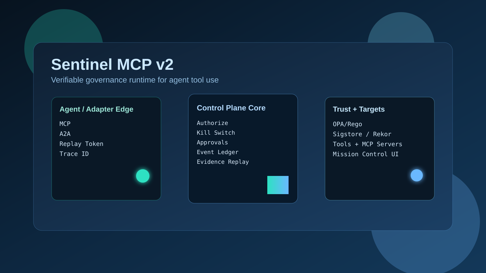
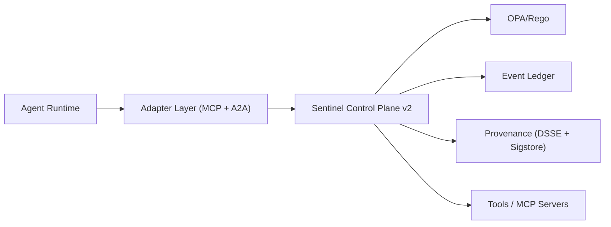
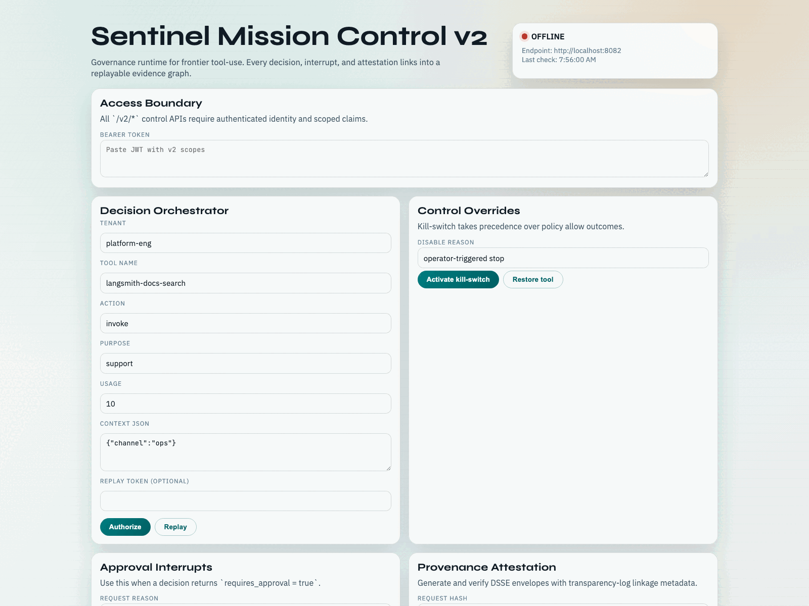
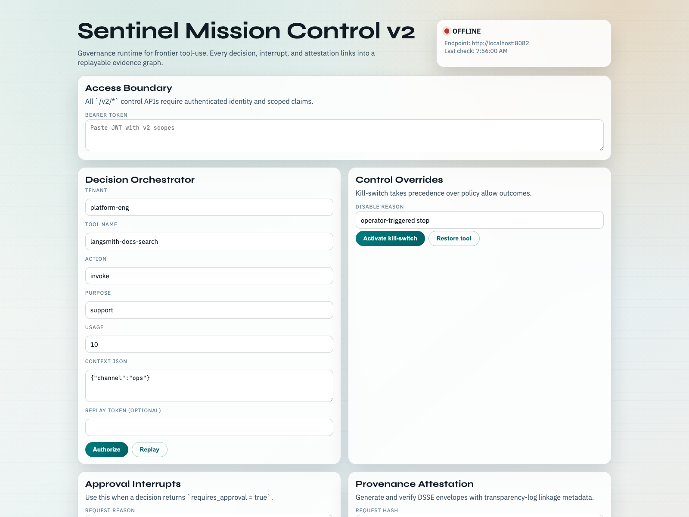

# Sentinel MCP

```text
  ███████╗███████╗███╗   ██╗████████╗██╗███╗   ██╗███████╗██╗     
  ██╔════╝██╔════╝████╗  ██║╚══██╔══╝██║████╗  ██║██╔════╝██║     
  ███████╗█████╗  ██╔██╗ ██║   ██║   ██║██╔██╗ ██║█████╗  ██║     
  ╚════██║██╔══╝  ██║╚██╗██║   ██║   ██║██║╚██╗██║██╔══╝  ██║     
  ███████║███████╗██║ ╚████║   ██║   ██║██║ ╚████║███████╗███████╗
  ╚══════╝╚══════╝╚═╝  ╚═══╝   ╚═╝   ╚═╝╚═╝  ╚═══╝╚══════╝╚══════╝

  MCP Governance Runtime • Verifiable Policy Enforcement • Provenance by Design
```

Governance control plane for agent tool use across MCP/A2A ecosystems.

[](https://github.com/jlov7/Sentinel-MCP/actions/workflows/ci.yml)
[](LICENSE)



## Why Sentinel MCP

AI agents can execute tools at machine speed; failures and misuse scale at machine speed too. Sentinel MCP adds an auditable decision layer between agents and tools so every invocation can be authorized, explained, replayed, and verified.

Core value:
- Deterministic policy enforcement (OPA/Rego as system of record)
- Human approval interrupts for high-risk actions
- Kill-switch controls with strong precedence guarantees
- Signed provenance with Sigstore-ready transparency linkage
- Event-sourced evidence for post-incident investigation and compliance

## One-Minute Architecture




## Product Storyboard





## Choose Your Path

- Non-technical overview: [Executive Brief](docs/governance/executive.md)
- Technical deep dive: [Architecture v2](docs/technical/architecture-v2.md)
- Quick onboarding: [Setup & Deployment](docs/technical/setup.md)
- Hands-on walkthrough: [Demo Guide](docs/demo.md)
- Operational response: [Runbooks](docs/operations/runbooks.md)
- Security posture: [Security & Compliance](docs/operations/security.md)
- API details: [v2 API Reference](docs/reference/api-v2.md)

## Quickstart (v2, local)

```bash
git clone https://github.com/jlov7/Sentinel-MCP.git
cd Sentinel-MCP

# Python + legacy stack deps
make install

# Rust v2 control plane
cd apps/control-plane-v2
cargo run
```

Run Mission Control UI:

```bash
cd apps/admin-console
npm install
NEXT_PUBLIC_CONTROL_PLANE_URL=http://localhost:8082 npm run dev
```

- UI: `http://localhost:3000`
- v2 health: `http://localhost:8082/healthz`

## Verifiable Governance: End-to-End

Decision traceability in v2:
1. `POST /v2/decisions/authorize` evaluates policy + risk
2. allow decisions auto-generate signed attestation (fail-closed if attestation persistence fails)
3. evidence replay available through `GET /v2/evidence/{trace_id}`
4. attestation verification through API and standalone CLI

Independent verifier example:

```bash
cd apps/control-plane-v2
cargo run --bin attestation_verify -- \
  --mode local \
  --secret "$SENTINEL_V2_DSSE_SIGNING_SECRET" \
  --envelope /path/to/envelope.json
```

## Quality Gates (Pre-Release)

Run the full gate:

```bash
make v2-release-gate
```

This runs:
- Rust format/lint/tests
- Performance/security regression suites
- Independent attestation verifier test
- Admin console lint/test/build
- Root Python pytest suite
- Machine-readable report output at `apps/control-plane-v2/eval/reports/latest.json`

## Repository Map

```text
apps/
  control-plane/            # v1 FastAPI baseline
  control-plane-v2/         # v2 Rust governance runtime
  admin-console/            # Mission control UI (Next.js)
packages/
  policy_engine/            # OPA policy client + helpers
  provenance/               # Provenance helpers (v1 path)
docs/
  governance/               # Non-technical and leadership docs
  technical/                # Architecture, setup, testing
  operations/               # Security + incident runbooks
  reference/                # API and release-gate references
  assets/                   # Diagrams, screenshots, illustrations
```

## Contribution Standards

- Keep policy changes test-backed and reviewable.
- Keep decision semantics deterministic and explicitly reason-coded.
- Keep docs synchronized with behavior changes (API, evidence fields, gate criteria).

See [CONTRIBUTING.md](CONTRIBUTING.md).

## Disclaimer

This repository is a personal R&D project created independently, is not affiliated with my employer, and does not represent my employer's views, systems, or roadmap.
