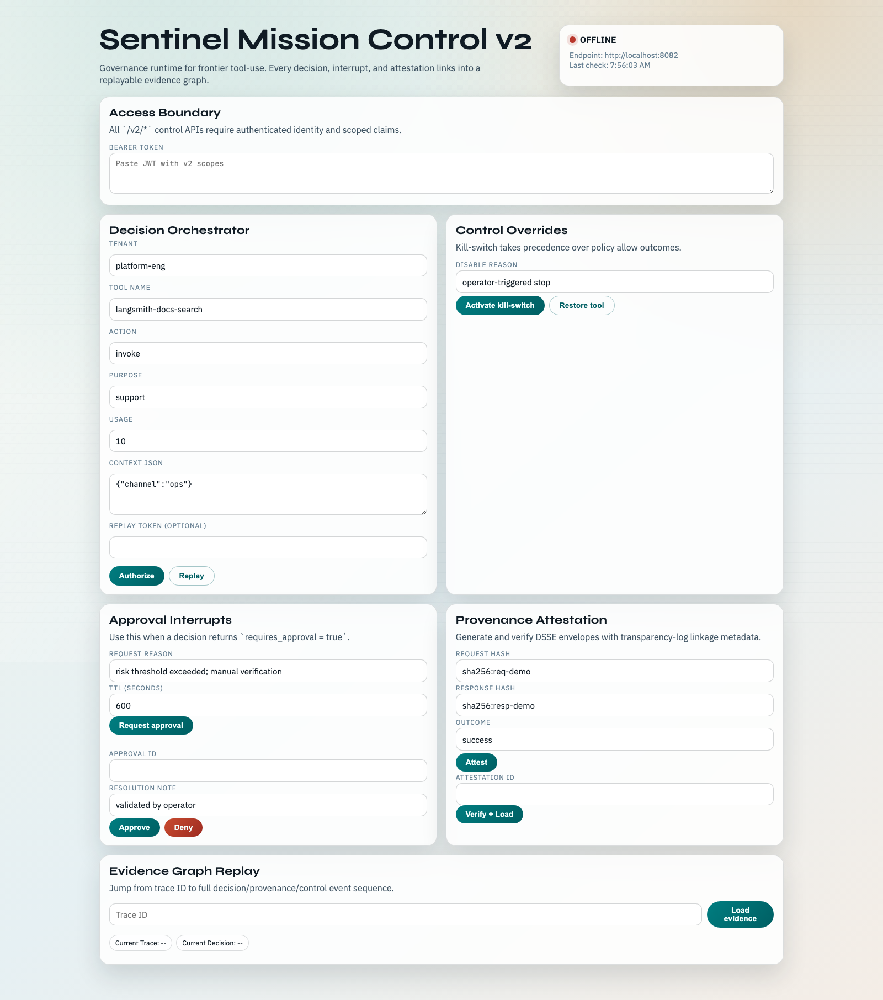

# Demo Walkthrough

This walkthrough demonstrates Sentinel MCP v2 from first decision to evidence replay.



## Prerequisites

- `apps/control-plane-v2` running on `http://localhost:8082`
- `apps/admin-console` running on `http://localhost:3000`
- Bearer token with required v2 scopes in Mission Control

## Walkthrough Flow

## 1. Authorize a Tool Invocation

In Mission Control:
- Tenant: `platform-eng`
- Tool: `langsmith-docs-search`
- Action: `invoke`
- Purpose: `support`

Run **Authorize**.

Expected result:
- `allow=true`
- `trace_id` populated
- `attestation_id` populated

## 2. Trigger and Validate Kill Switch Precedence

Use **Disable Tool**.

Run **Authorize** again with the same request.

Expected result:
- `allow=false`
- `reason_code=KILL_SWITCH_ACTIVE`

Restore the tool and verify normal flow resumes.

## 3. Request and Resolve Approval

Use a high-risk call profile (higher usage/sensitive purpose).

Expected result:
- `requires_approval=true`
- create approval request with TTL
- resolve approval as operator

## 4. Inspect Provenance + Evidence

- Load attestation by `attestation_id`
- Run attestation verification
- Retrieve evidence by `trace_id`

Expected result:
- trace includes decision and provenance events
- attestation verifies successfully

## 5. Replay Decision

Use replay endpoint from Mission Control with a new replay token.

Expected result:
- deterministic decision for same policy state
- stale/duplicate replay tokens are rejected

## CLI Companion Steps

```bash
# Health
curl http://localhost:8082/healthz

# Example authorize
curl -X POST http://localhost:8082/v2/decisions/authorize \
  -H "Authorization: Bearer <token>" \
  -H "Content-Type: application/json" \
  -d '{"tenant_slug":"platform-eng","tool_name":"langsmith-docs-search","action":"invoke","purpose":"support","usage":10,"context":{}}'
```

## Demo Outcome Checklist

- [ ] Decision received with reason-code semantics
- [ ] Kill-switch precedence proven
- [ ] Approval path exercised
- [ ] Signed provenance retrieved and verified
- [ ] Evidence replay completed via `trace_id`
