# Sentinel MCP Documentation

Sentinel MCP is a governance runtime for agent tool use. It enforces policy, issues explainable decisions, records evidence, and emits cryptographically verifiable provenance.

## Audience Paths

## For Product, Risk, and Leadership

Start with:
- [Executive Brief](governance/executive.md)
- [Security & Compliance](operations/security.md)

What you get:
- Plain-language explanation of risk reduction
- Operational and audit readiness model
- Adoption and rollout framing

## For Engineers and Platform Teams

Start with:
- [Architecture v2](technical/architecture-v2.md)
- [Setup & Deployment](technical/setup.md)
- [v2 API Reference](reference/api-v2.md)

What you get:
- API contracts, runtime topology, and control flow
- Local onboarding and deployment checklist
- Release-gate and verification mechanics

## For Operators and Incident Responders

Start with:
- [Runbooks](operations/runbooks.md)
- [Demo Walkthrough](demo.md)
- [Testing Strategy](technical/testing.md)

What you get:
- Incident handling procedures
- Fast reproduction and replay flow
- Quality gates and failure-mode checks

## Documentation Map

| Goal | Primary Doc | Supporting Docs |
|---|---|---|
| Understand business value | [Executive Brief](governance/executive.md) | [Security](operations/security.md) |
| Understand architecture | [Architecture v2](technical/architecture-v2.md) | [API Reference](reference/api-v2.md) |
| Run locally in minutes | [Setup](technical/setup.md) | [Demo](demo.md) |
| Validate release quality | [Testing Strategy](technical/testing.md) | [Release Gate](reference/release-gate.md) |
| Respond to incidents | [Runbooks](operations/runbooks.md) | [Policy Playbook](governance/policy-playbook.md) |

## Visual Tour

- System architecture: [architecture-overview.svg](assets/diagrams/architecture-overview.svg)
- Decision path: [decision-sequence.svg](assets/diagrams/decision-sequence.svg)
- Evidence graph: [evidence-graph.svg](assets/diagrams/evidence-graph.svg)
- Mission control walkthrough: [mission-control-walkthrough.gif](assets/screenshots/mission-control-walkthrough.gif)

## Repository Positioning

Sentinel MCP is an advanced personal R&D project focused on frontier governance patterns for tool-using agents. It is not positioned as a commercial product.
