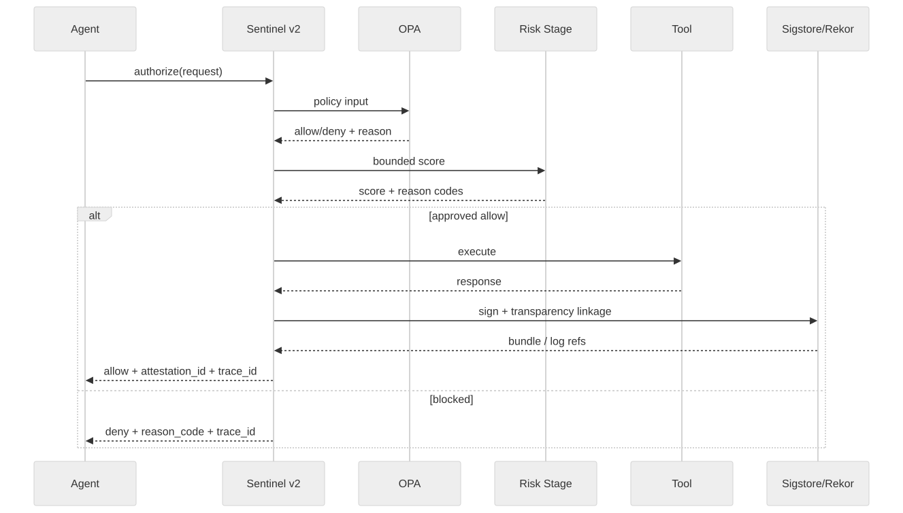
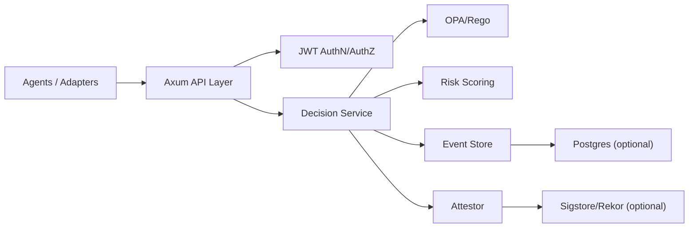

# Architecture v2 (Rust Control Plane)

Sentinel MCP v2 is a Rust-first governance runtime for agent tool use with deterministic authorization, event-sourced evidence, and verifiable provenance.

## Design Principles

- Deterministic first: policy is authoritative, explainability is mandatory
- Fail-closed for high-risk failure modes
- Cryptographic provenance for integrity and replay confidence
- Tenant isolation enforced on write and read paths
- Operationally testable through reproducible release gates

## Runtime Topology

## Authorization Pipeline

1. Request validation + scope/tenant checks
2. Replay token reservation (anti-replay)
3. Kill-switch precedence gate
4. OPA policy evaluation (authoritative)
5. Bounded risk scoring stage
6. Approval requirement gating (when threshold exceeded)
7. Decision assembly with stable reason code semantics
8. Automatic attestation for allowed decisions
9. Event append for evidence/replay

### Decision Semantics

- `allow=true` requires successful attestation persistence
- if attestation fails, decision is denied with `ATTESTATION_FAILED`
- deny paths always include reason-code semantics for operator clarity

## API Surface

Primary endpoints:
- `POST /v2/decisions/authorize`
- `POST /v2/replay/decision`
- `POST /v2/control/kill-switch`
- `POST /v2/control/kill-switch/restore`
- `POST /v2/approvals/request`
- `POST /v2/approvals/{id}/resolve`
- `POST /v2/provenance/attest`
- `GET /v2/provenance/{attestation_id}`
- `GET /v2/provenance/{attestation_id}/verify`
- `GET /v2/evidence/{trace_id}`
- `POST /v2/interop/mcp/authorize`
- `POST /v2/interop/a2a/authorize`
- `GET /v2/meta/protocols`
- `GET /v2/meta/policy-bundle`

See full contract details in [v2 API Reference](../reference/api-v2.md).

## Provenance Model

Envelope format:
- DSSE-style envelope with payload + signatures
- `attestation_id` and `trace_id` for linkage
- `rekor_log_index`, `rekor_uuid`, and `rekor_log_id` for transparency metadata

Attestation modes:
- `local`: deterministic local signer
- `rekor`: Rekor-linked mode
- `sigstore_keyless`: Fulcio + Sigstore verification path with bundle embedding

## Evidence Graph

Traceability expectation:
- every authorized invocation has a corresponding signed attestation
- every decision and provenance action is reconstructable via `trace_id`

## Observability

- Structured tracing/logging with OpenTelemetry hooks
- Decision and control events designed for incident replay workflows
- Release gate emits machine-readable evidence (`latest.json`) for CI artifacts

## Security Posture

- Scoped JWT boundary for all `/v2/*` endpoints
- Tenant isolation on decision/provenance/evidence paths
- Fail-closed behavior for policy/attestation risk-sensitive paths

## Migration Positioning

v1 remains available as a legacy baseline. v2 is the reference runtime for frontier governance and verification workflows.
