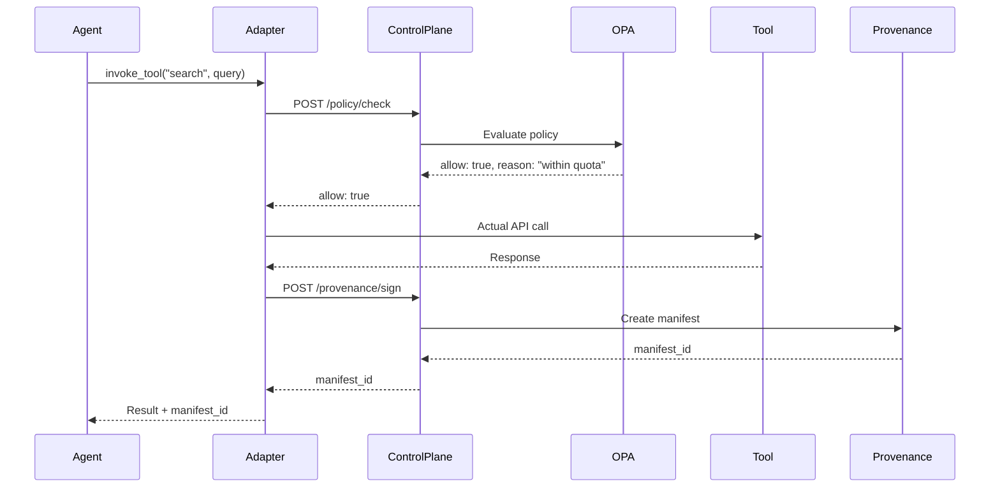

# Architecture Deep Dive

## The Big Picture

Sentinel MCP implements a **control plane architecture**—a centralized system that sits between AI agents and the tools they want to use. This design pattern is essential for governing autonomous systems where you can't rely on traditional perimeter security.

**Why a control plane?**
- **Centralized governance** – One place to enforce policies
- **Consistent behavior** – Same rules apply everywhere
- **Complete visibility** – All decisions logged and auditable
- **Instant control** – Kill switches work system-wide

## High-Level Flow

When an AI agent wants to use a tool, here's what happens:

```
1. Agent → Adapter: "I want to call tool X"
2. Adapter → Control Plane: "Check if this is allowed"
3. Control Plane → Policy Engine: "Evaluate policy"
4. Policy Engine → Control Plane: "Allow/Deny + reasoning"
5. Control Plane → Adapter: "Decision"
6. If allowed:
   - Adapter → Agent: "Proceed"
   - Adapter → Control Plane: "Sign this action"
   - Control Plane → Provenance: "Create manifest"
7. If denied:
   - Adapter → Agent: "Blocked: [reason]"
   - Control Plane → Audit Log: "Denied: [reason]"
```

**Key insight:** The agent never talks directly to the tool. Everything flows through the control plane, ensuring governance happens at every step.

## Component Architecture

### Control Plane API (FastAPI)

**Technology:** Python 3.11+, FastAPI, SQLAlchemy

**Responsibilities:**
- Tool registry and inventory management
- Policy evaluation proxy (delegates to OPA)
- Kill-switch orchestration
- Provenance manifest creation
- Audit logging

**Key Endpoints:**
- `POST /register` – Register a new tool
- `POST /policy/check` – Request authorization decision
- `POST /kill` – Disable a tool (kill switch)
- `POST /kill/restore` – Re-enable a tool
- `POST /provenance/sign` – Create provenance manifest
- `GET /provenance/verify/{id}` – Verify a manifest

**Design decisions:**
- **FastAPI** chosen for its async capabilities and automatic OpenAPI docs
- **SQLAlchemy** for database abstraction and migrations
- **Structlog** for structured, queryable logs

### Database Layer (PostgreSQL)

**Technology:** PostgreSQL 16

**Schema highlights:**

**Tenants Table:**
```sql
- id (UUID, primary key)
- slug (text, unique)
- display_name (text)
- created_at (timestamp)
```

**Tools Table:**
```sql
- id (UUID, primary key)
- tenant_id (UUID, foreign key)
- name (text)
- url (text)
- owner (text)
- scopes (JSONB)  -- Flexible scopes/metadata
- extra_metadata (JSONB)  -- Tool-specific data
- is_active (boolean)  -- Kill switch state
- created_at, updated_at (timestamps)
```

**Policy Logs Table:**
```sql
- id (UUID, primary key)
- tenant_id (UUID, foreign key)
- tool_id (UUID, foreign key)
- decision (text: "allow" | "deny")
- reason (text)
- event_metadata (JSONB)
- created_at (timestamp)
```

**Why PostgreSQL?**
- **JSONB support** – Flexible metadata storage
- **ACID compliance** – Critical for audit logs
- **Mature ecosystem** – Alembic migrations, connection pooling
- **Production-ready** – Battle-tested at scale

### Policy Engine (OPA)

**Technology:** Open Policy Agent (OPA) with Rego policies

**Why OPA?**
- **Policy-as-Code** – Version control, testing, collaboration
- **Declarative** – Policies describe "what" not "how"
- **Language-agnostic** – Works with any system
- **Fast** – Microsecond evaluation times
- **Proven** – Used by major tech companies

**Policy Evaluation Flow:**
```
1. Control Plane receives authorization request
2. Constructs input document:
   {
     "tenant": "platform-eng",
     "tool": "langsmith-docs-search",
     "purpose": "documentation_lookup",
     "usage": 42,
     "context": {...}
   }
3. Sends to OPA with policy bundle
4. OPA evaluates Rego rules
5. Returns decision + reasoning
```

**Sample Policy (Rego):**
```rego
package sentinel.policy

default allow := false

allow {
    allowed_tool[input.tool]
    within_quota
    purpose_ok
}

allowed_tool[tool] {
    data.allowlist[input.tenant][tool]
}

within_quota {
    input.usage < data.quotas[input.tenant][input.tool]
}

purpose_ok {
    input.purpose in data.allowed_purposes[input.tenant][input.tool]
}
```

**OPA Deployment:**
- **Development:** Docker Compose sidecar
- **Production:** Kubernetes sidecar or separate service
- **Policy Updates:** GitOps workflow (bundle from Git)

### Provenance Service

**Technology:** Custom Python module, Sigstore-compatible design

**What it does:**
- Creates cryptographically signed manifests
- Stores manifests for verification
- Provides verification endpoints
- Supports C2PA-style provenance

**Manifest Structure:**
```json
{
  "id": "manifest-uuid",
  "timestamp": "2024-01-15T10:30:00Z",
  "tenant": "platform-eng",
  "tool": "langsmith-docs-search",
  "action": "invoke",
  "purpose": "documentation_lookup",
  "payload_hash": "sha256:...",
  "signature": "...",
  "metadata": {...}
}
```

**Current implementation:**
- Uses local signing key (`.env` SIGNING_KEY)
- Stores manifests in `.data/provenance/`
- Provides verification endpoint

**Production target:**
- Sigstore integration for public-key infrastructure
- Immutable storage (S3 + Glacier)
- Rekor integration for transparency logs

### Admin Console (Next.js)

**Technology:** Next.js, React, TypeScript

**Features:**
- **Tool Inventory** – Browse all registered tools
- **Kill Switch UI** – One-click disable/enable
- **Policy Probes** – Test policies before deployment
- **Manifest Viewer** – Verify provenance manifests

**Architecture:**
- Client-side React app
- REST API integration with control plane
- Real-time updates via polling (future: WebSockets)

**Deployment:**
- **Development:** `npm run dev` (localhost:3000)
- **Production:** Static export (`npm run build`) → CDN

### Agent Adapters

**Purpose:** Bridge between agent frameworks and Sentinel MCP

**Design Pattern:**
```python
class Adapter:
    async def invoke_tool(self, tool_name, params):
        # 1. Check authorization
        decision = await control_plane.check_policy(...)
        if not decision.allow:
            raise PolicyDenied(decision.reason)
        
        # 2. Invoke tool
        result = await self._actual_tool_call(tool_name, params)
        
        # 3. Sign provenance
        manifest = await control_plane.sign_provenance(...)
        
        return result
```

**Available Adapters:**
- **AgentKit Adapter** (`agentkit_adapter.py`) – OpenAI AgentKit integration
- **LangGraph Middleware** (`langgraph_middleware.py`) – LangGraph integration
- **Claude Skills Hook** (`skills_hook.ts`) – TypeScript hook for Claude

**Extending:**
- Implement adapter interface
- Handle authorization checks
- Sign provenance after actions
- Handle kill-switch signals

## Data Flow: Tool Invocation Sequence



**If policy denies:**
```
Adapter->>ControlPlane: POST /policy/check
ControlPlane->>OPA: Evaluate policy
OPA-->>ControlPlane: allow: false, reason: "quota exceeded"
ControlPlane-->>Adapter: allow: false, reason: "quota exceeded"
Adapter-->>Agent: PolicyDenied("quota exceeded")
```

## Observability & Telemetry

### Structured Logging (Structlog)

**What gets logged:**
- Policy decisions (`policy.check.allow`, `policy.check.deny`)
- Kill-switch events (`kill_switch.disabled`, `kill_switch.restored`)
- Provenance events (`provenance.signed`, `provenance.verified`)
- Errors with full context

**Log format:**
```json
{
  "event": "kill_switch.disabled",
  "tenant": "platform-eng",
  "tool": "langsmith-docs-search",
  "reason": "security_incident",
  "timestamp": "2024-01-15T10:30:00Z",
  "metadata": {...}
}
```

### OpenTelemetry Spans

**Current implementation:**
- Wraps kill-switch handlers
- Tracks tenant/tool metadata
- Measures latency

**Future expansion:**
- Policy evaluation spans
- Provenance signing spans
- Full request tracing
- Export to Tempo, Jaeger, or Honeycomb

### Metrics (Future)

**Recommended metrics:**
- Policy check latency (p50, p95, p99)
- Kill-switch MTTR
- Quota utilization rates
- Provenance signing success rate
- Error rates by endpoint

## Deployment Architectures

### Local Development

**Stack:**
```
docker-compose.dev.yml
├── postgres:16
├── redis:7
├── opa (sidecar)
└── control-plane (FastAPI)
```

**Admin Console:** Runs separately with `npm run dev`

**Pros:**
- Fast iteration
- Easy debugging
- Complete isolation

**Cons:**
- Not production-like
- Single tenant

### Production Architecture

**Recommended:**
```
┌─────────────────────────────────┐
│   Load Balancer (TLS)           │
└────────────┬────────────────────┘
             │
    ┌────────▼────────┐
    │  Control Plane  │
    │  (Kubernetes)   │
    │  - FastAPI pods │
    │  - OPA sidecar  │
    └────────┬────────┘
             │
    ┌────────▼────────┐
    │   PostgreSQL    │
    │  (Managed DB)   │
    └─────────────────┘
```

**Components:**
- **Control Plane:** Kubernetes deployment with HPA
- **Database:** Managed PostgreSQL (AWS RDS, GCP Cloud SQL)
- **Cache:** Managed Redis (ElastiCache, Memorystore)
- **Secrets:** Vault or cloud secrets manager
- **OPA:** Sidecar or separate service
- **Admin Console:** Static site on CDN

**Security:**
- TLS everywhere
- mTLS for service-to-service
- Secrets rotation
- Network policies
- RBAC for Kubernetes

## Scalability Considerations

### Horizontal Scaling

**Control Plane:**
- Stateless design enables horizontal scaling
- Load balancer distributes requests
- Database connection pooling

**OPA:**
- Stateless evaluation
- Can run as sidecar or service
- Policy bundles cached in memory

### Database Scaling

**Read Replicas:**
- Policy logs are read-heavy
- Use replicas for reporting

**Partitioning:**
- Partition policy logs by date
- Archive old logs

### Caching Strategy

**Redis Usage:**
- Rate limit counters (future)
- Kill-switch broadcast cache (future)
- Policy decision cache (future)

## Security Architecture

### Defense in Depth

1. **Network Layer:** TLS, mTLS, network policies
2. **Application Layer:** Policy enforcement, input validation
3. **Data Layer:** Encryption at rest, access controls
4. **Identity Layer:** API keys, OIDC (future)

### Threat Model

**Threats mitigated:**
- ✅ Unauthorized tool access → Policy enforcement
- ✅ Compromised credentials → Kill switch
- ✅ Policy bypass → Control plane architecture
- ✅ Provenance tampering → Cryptographic signatures

**Future enhancements:**
- Rate limiting at network layer
- DDoS protection
- Advanced threat detection

## Performance Characteristics

**Policy Check Latency:**
- Target: < 10ms p95
- OPA evaluation: < 1ms typically
- Database query: < 5ms typically

**Kill Switch MTTR:**
- Target: < 5 seconds
- Database update: < 100ms
- Adapter notification: < 1s
- State propagation: < 5s total

**Throughput:**
- Target: 1000+ policy checks/second
- Database: Scales with connection pooling
- OPA: Scales horizontally

## Future Architecture Evolution

**Short-term:**
- Sigstore integration for provenance
- Redis-based rate limiting
- WebSocket support for real-time updates

**Medium-term:**
- Policy decision caching
- Advanced observability (OTel exports)
- Terraform modules for cloud deployment

**Long-term:**
- Multi-region support
- Policy graph with relationships
- ML-based anomaly detection

---

**Understanding the architecture helps you:**
- Make informed deployment decisions
- Troubleshoot issues effectively
- Extend the system confidently
- Plan for scale

Next: [Setup Guide](setup.md) for hands-on deployment.
