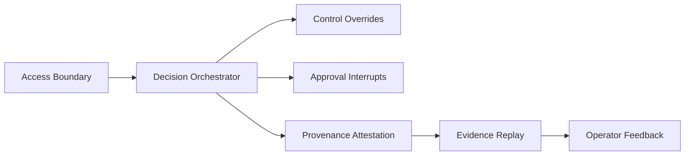
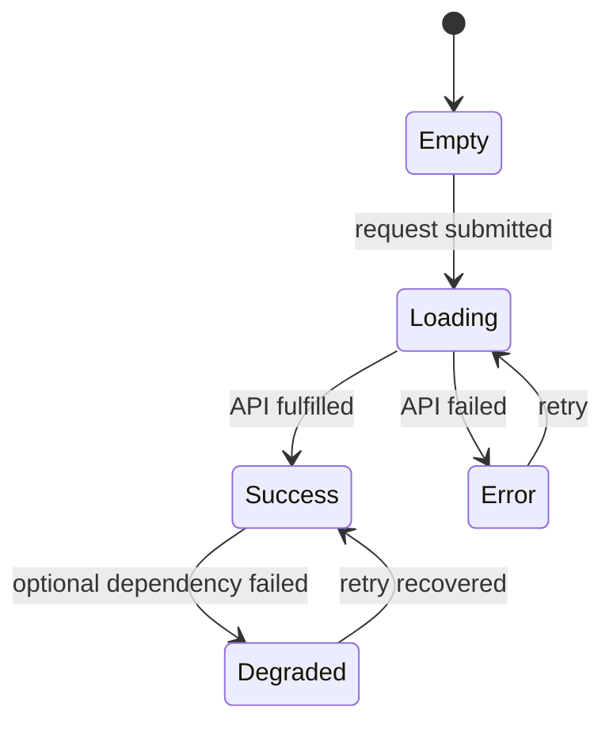

# Front-End Mission Control (v2)

## Non-Technical Overview
Mission Control is the operator cockpit for governing AI tool execution safely. It helps an operator answer five questions fast:
1. Was this action allowed or denied?
2. Did controls (kill-switch/approval) apply correctly?
3. Is provenance cryptographically verifiable?
4. Can we replay exactly what happened from a trace ID?
5. What should the operator do next?

## Technical Overview
The UI is a Next.js app with a single orchestration hook (`useMissionControl`) coordinating:
- authenticated API calls to `/v2/*`
- deterministic busy/error/success/degraded states
- journey timing metrics (decision -> approval -> provenance -> evidence)
- UX telemetry + local operator feedback capture
- high-signal toasts with explicit next-step guidance

## Workflow Topology

## State Model

## Quality Gates
- `npm run lint`
- `npm run test`
- `npm run test:a11y`
- `npm run build`
- `npm run perf:budget`
- `npm run test:e2e`

## Accessibility Baseline
- Semantic landmarks and heading hierarchy
- Keyboard reachable controls
- Visible focus treatment
- ARIA live regions for dynamic status and toasts
- Axe gate in CI (`MissionControl.a11y.test.tsx`)

## Performance Baseline
- Bundle budget enforced via `scripts/check-performance-budget.mjs`
- Build-time budget check in CI
- E2E journey test to detect interaction regressions

## R&D Disclaimer
This interface is a personal R&D artifact and not affiliated with any employer.
